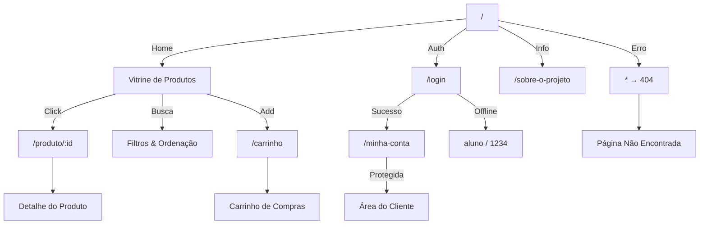
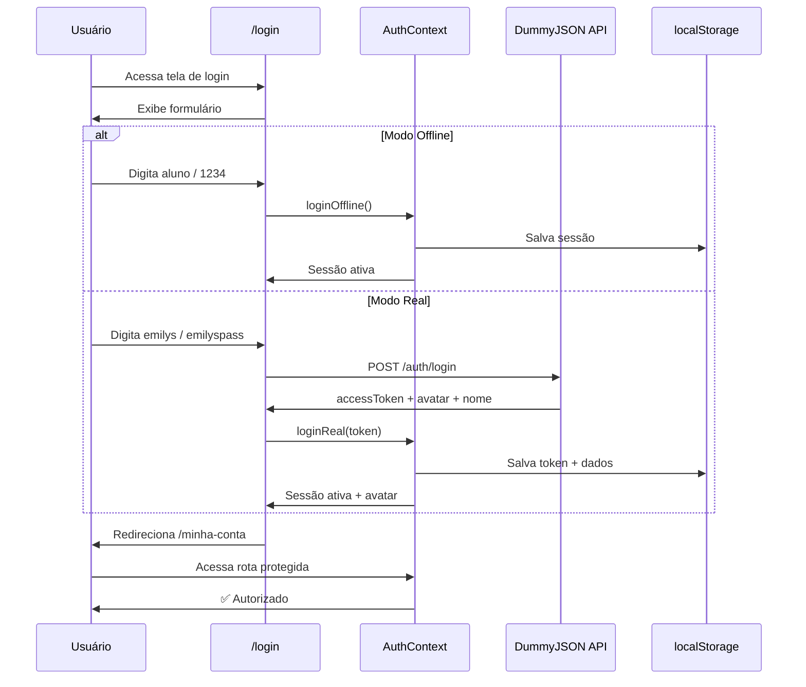

# <p align="center">⚡ Núcleo TADS Store</p>

<p align="center">
  
</p>

<p align="center">
  <a href="https://github.com/matheusflorindo32/nucleo-storefront/stargazers">
    
  </a>
  <a href="https://github.com/matheusflorindo32/nucleo-storefront/network/members">
    
  </a>
  <a href="https://github.com/matheusflorindo32/nucleo-storefront/issues">
    
  </a>
  
</p>

<p align="center">
  
  
  
  
  
  
</p>

---

## 📑 Índice

<details open>
<summary><b>Clique para expandir/contrair</b></summary>

- [🎯 Visão Geral](#-visão-geral)
- [✨ Funcionalidades](#-funcionalidades)
- [🏗️ Arquitetura](#️-arquitetura)
- [🧱 Tech Stack](#-tech-stack)
- [🚀 Como Executar](#-como-executar)
- [🔐 Autenticação](#-autenticação)
- [📁 Estrutura](#-estrutura)
- [📸 Screenshots](#-screenshots)
- [✅ Checklist](#-checklist)
- [📊 Estatísticas](#-estatísticas)
- [👤 Autor](#-autor)

</details>

---

## 🎯 Visão Geral

<table>
<tr>
<td width="60%">

**Núcleo TADS Store** é uma **loja virtual acadêmica full-stack** desenvolvida para a disciplina **Desenvolvimento Front-End II** do curso **TADS (Tecnologia em Análise e Desenvolvimento de Sistemas)** no **IFES — Campus de Alegre**.

O projeto foi construído em **4 etapas evolutivas**, cada uma adicionando camadas de complexidade técnica:

| Etapa | Foco | Complexidade |
|-------|------|-------------|
| 1 | Componentização & Props | ⭐⭐ |
| 2 | Estado, Hooks & API | ⭐⭐⭐ |
| 3 | Navegação SPA | ⭐⭐⭐⭐ |
| 4 | Autenticação & Context | ⭐⭐⭐⭐⭐ |

**Destaques Técnicos:**
- 🔥 **Login real** com API DummyJSON (token + avatar)
- 🛒 **Carrinho de compras** com persistência local
- 🎨 **Design system próprio** em CSS puro
- 📱 **100% Responsivo** (mobile-first)
- ⚡ **Performance otimizada** com Vite + lazy loading

</td>
<td width="40%">

```
┌────────────────────────────────┐
│     🏪 NÚCLEO TADS STORE      │
├────────────────────────────────┤
│  ┌────┐ ┌────┐ ┌────┐ ┌────┐  │
│  │ 🖥️ │ │ 📱 │ │ 💻 │ │ 🎧 │  │
│  └────┘ └────┘ └────┘ └────┘  │
│  ┌────┐ ┌────┐ ┌────┐ ┌────┐  │
│  │ ⌨️ │ │ 🖱️ │ │ 📷 │ │ 🎮 │  │
│  └────┘ └────┘ └────┘ └────┘  │
├────────────────────────────────┤
│   🛒 2 itens  |  💰 R$ 1.299  │
│   👤 Entrar   |  🔍 Buscar    │
└────────────────────────────────┘
```

</td>
</tr>
</table>

---

## ✨ Funcionalidades

<div align="center">

| 🔧 Componentização | 🔄 Estado & Hooks | 🧭 Navegação SPA | 🔐 Autenticação |
|:---:|:---:|:---:|:---:|
| Layout com `children` | `useState` + `useEffect` | React Router DOM | `AuthContext` + `useAuth` |
| Props & Composição | `useProdutos` custom | Rotas dinâmicas | Login real DummyJSON |
| Renderização condicional | Busca, Filtro, Ordenação | Parâmetros na URL | Fallback offline |
| `.map()` em listas | Loading, Erro, Vazio | State persistence | `localStorage` sync |
| Skeleton loading | DummyJSON API | 404 personalizada | Rota protegida |

</div>

### 🎁 Bônus Implementados

> **Nível Hard:** Recursos extras que elevam o projeto além dos requisitos acadêmicos

<div align="center">

<table>
<tr>
<td align="center" width="33%">

### 🔑 Login Real
API DummyJSON com `accessToken` + avatar real do usuário

</td>
<td align="center" width="33%">

### 🛒 Carrinho Inteligente
`CartContext` paralelo, badge no header, frete grátis > R$ 299

</td>
<td align="center" width="33%">

### 🚀 Deploy Online
Publicado na **Lovable** com CI/CD contínuo

</td>
</tr>
</table>

</div>

### 🗺️ Mapa de Rotas



---

## 🏗️ Arquitetura

```
┌─────────────────────────────────────────────────────────────┐
│                    📱 INTERFACE (React)                      │
├─────────────────────────────────────────────────────────────┤
│  ┌─────────┐  ┌─────────┐  ┌─────────┐  ┌─────────┐        │
│  │  Home   │  │Detalhe  │  │ Login   │  │Carrinho │        │
│  │ (Pages) │  │ (Pages) │  │ (Pages) │  │ (Pages) │        │
│  └────┬────┘  └────┬────┘  └────┬────┘  └────┬────┘        │
├───────┼────────────┼────────────┼────────────┼─────────────┤
│  ┌────┴────┐  ┌────┴────┐  ┌────┴────┐  ┌────┴────┐      │
│  │Vitrine  │  │Produto  │  │AcaoAuth │  │CartIcone│      │
│  │Card     │  │Gallery  │  │         │  │         │      │
│  │Skeleton │  │Breadcrumb│ │         │  │         │      │
│  └────┬────┘  └────┬────┘  └────┬────┘  └────┬────┘      │
├───────┼────────────┼────────────┼────────────┼─────────────┤
│  ┌────┴────────────┴────────────┴────────────┴────┐       │
│  │              🔄 CONTEXT PROVIDERS                │       │
│  │     AuthContext ◄────► CartContext              │       │
│  │          │                  │                   │       │
│  │          └─────────────────┘                   │       │
│  └──────────────────────┬────────────────────────────┘       │
├─────────────────────────┼───────────────────────────────────┤
│  ┌──────────────────────┴────────────────────────────┐      │
│  │              🪝 CUSTOM HOOKS                     │      │
│  │   useProdutos │ useProdutoDetalhe │ useCategorias │      │
│  └──────────────────────┬────────────────────────────┘      │
├─────────────────────────┼───────────────────────────────────┤
│  ┌──────────────────────┴────────────────────────────┐      │
│  │              🔌 SERVICES                         │      │
│  │              api.js → DummyJSON                  │      │
│  └──────────────────────────────────────────────────┘      │
└─────────────────────────────────────────────────────────────┘
```

---

## 🧱 Tech Stack

<div align="center">

### Core
<p>
  <a href="https://react.dev"></a>
  <a href="https://vitejs.dev"></a>
  <a href="https://reactrouter.com"></a>
</p>

### Estilização & Ferramentas
<p>
  <a href="https://developer.mozilla.org/pt-BR/docs/Web/CSS"></a>
  <a href="https://developer.mozilla.org/pt-BR/docs/Web/HTML"></a>
  <a href="https://developer.mozilla.org/pt-BR/docs/Web/JavaScript"></a>
  <a href="https://nodejs.org"></a>
</p>

### Deploy & CI/CD
<p>
  <a href="https://github.com"></a>
  <a href="https://git-scm.com"></a>
</p>

</div>

---

## 🚀 Como Executar

### ⚡ Quick Start

```bash
# Clone o repositório
git clone https://github.com/matheusflorindo32/nucleo-storefront.git

# Entre na pasta
cd nucleo-storefront

# Instale as dependências
npm install

# Inicie o servidor de desenvolvimento
npm run dev
```

### 🌐 Acesse
```
http://localhost:5173
```

### 📦 Build para Produção
```bash
npm run build
npm run preview
```

---

## 🔐 Autenticação

O sistema possui **dois modos de login** na mesma tela:

<div align="center">

<table>
<tr>
<th>Modo</th>
<th>Usuário</th>
<th>Senha</th>
<th>Origem</th>
</tr>
<tr>
<td>🔴 <b>Offline (Fallback)</b></td>
<td><code>aluno</code></td>
<td><code>1234</code></td>
<td>Simulado localmente</td>
</tr>
<tr>
<td>🟢 <b>Real DummyJSON</b></td>
<td><code>emilys</code></td>
<td><code>emilyspass</code></td>
<td>API pública + token</td>
</tr>
</table>

</div>

### Fluxo de Autenticação



---

## 📁 Estrutura

```
nucleo-storefront/
├── 📂 docs/
│   └── 📂 prints/               # Screenshots do projeto
│       ├── 01-home.png
│       ├── 02-detalhe.png
│       ├── 03-login.png
│       ├── 04-minha-conta.png
│       ├── 05-404.png
│       ├── 06-carrinho.png
│       └── 07-login-real.png
│
├── 📂 public/                   # Assets estáticos
│
├── 📂 src/
│   ├── 📂 components/           # 🧩 Componentes reutilizáveis
│   │   ├── AcaoAuth.jsx         # Ações de login/logout
│   │   ├── Botao.jsx            # Componente botão
│   │   ├── Cabecalho.jsx        # Header com navegação
│   │   ├── CarrinhoIcone.jsx    # Ícone do carrinho com badge
│   │   ├── Diferenciais.jsx     # Seção de diferenciais
│   │   ├── EstadoVazio.jsx      # Estado vazio (ilustração)
│   │   ├── FiltroCategorias.jsx # Filtro por categoria
│   │   ├── Layout.jsx           # Wrapper com children
│   │   ├── Leads.jsx            # Captura de leads
│   │   ├── LogoNTS.jsx          # Logo animado
│   │   ├── MenuTopo.jsx         # Menu de navegação
│   │   ├── MensagemErro.jsx     # Feedback de erro
│   │   ├── Newsletter.jsx       # Assinatura newsletter
│   │   ├── Politicas.jsx        # Políticas da loja
│   │   ├── ProdutoCard.jsx      # Card de produto
│   │   ├── RodaPe.jsx           # Footer
│   │   ├── RotaPrivada.jsx      # Guardião de rotas
│   │   ├── ScrollToTop.jsx      # Scroll automático
│   │   ├── SecaoTitulo.jsx      # Título de seção
│   │   ├── Selo.jsx             # Selo de qualidade
│   │   ├── SkeletonProduto.jsx  # Loading skeleton
│   │   └── SobreContato.jsx     # Informações de contato
│   │
│   ├── 📂 contexts/             # 🌐 Contextos globais
│   │   ├── AuthContext.jsx      # Gerenciamento de sessão
│   │   └── CartContext.jsx      # Gerenciamento do carrinho
│   │
│   ├── 📂 hooks/                # 🪝 Hooks customizados
│   │   ├── useCategorias.js     # Fetch de categorias
│   │   ├── useProdutoDetalhe.js # Detalhe de produto
│   │   └── useProdutos.js       # Lista de produtos
│   │
│   ├── 📂 pages/                # 📄 Páginas da aplicação
│   │   ├── Carrinho.jsx         # Página do carrinho
│   │   ├── Detalhe.jsx          # Detalhe do produto
│   │   ├── Home.jsx             # Página inicial
│   │   ├── Login.jsx            # Tela de login
│   │   ├── MinhaConta.jsx       # Área do cliente
│   │   ├── NaoEncontrado.jsx   # Página 404
│   │   └── SobreProjeto.jsx    # Documentação acadêmica
│   │
│   ├── 📂 services/             # 🔌 Serviços externos
│   │   └── api.js               # Cliente DummyJSON
│   │
│   ├── 📂 utils/                # 🛠️ Utilitários
│   │   └── formatadores.js      # Formatação de preço (R$)
│   │
│   ├── App.css                  # 🎨 Design system
│   ├── App.jsx                  # 📍 Definição de rotas
│   └── main.jsx                 # 🚀 Bootstrap + Providers
│
├── .gitignore                   # 🚫 Arquivos ignorados
├── index.html                   # 📄 HTML base
├── logo-nts.jpg                 # 🖼️ Logo da loja
├── package.json                 # 📦 Dependências
├── vite.config.js               # ⚡ Config Vite
└── README.md                    # 📖 Você está aqui!
```

---

## 📸 Screenshots

<div align="center">

<table>
<tr>
<td align="center" width="50%">

### 🏠 Página Inicial
*Catálogo de produtos com filtros*

```
┌────────────────────────────┐
│  🏪 NÚCLEO TADS STORE      │
│  [🔍 Buscar...] [👤] [🛒] │
├────────────────────────────┤
│  [💻] [📱] [🎧] [⌨️]      │
│  [🖱️] [📷] [🎮] [🖥️]      │
│                            │
│  ┌────┐ ┌────┐ ┌────┐     │
│  │🖥️  │ │📱  │ │💻  │     │
│  │R$5K│ │R$3K│ │R$8K│     │
│  └────┘ └────┘ └────┘     │
│                            │
│  [Anterior] 1 2 3 [Próx]  │
└────────────────────────────┘
```

</td>
<td align="center" width="50%">

### 🔍 Detalhe do Produto
*Galeria, breadcrumbs, specs*

```
┌────────────────────────────┐
│  Início > Eletrônicos > 💻 │
├────────────────────────────┤
│  ┌────────┐              │
│  │        │  MacBook Pro │
│  │  [📷]  │  R$ 12.999  │
│  │        │  ⭐ 4.8 (42) │
│  └────────┘              │
│  [🖼️] [🖼️] [🖼️]          │
│                            │
│  [🛒 Adicionar]           │
│  [❤️ Favoritar]           │
└────────────────────────────┘
```

</td>
</tr>
<tr>
<td align="center" width="50%">

### 🔐 Tela de Login
*Dois modos: Offline + Real*

```
┌────────────────────────────┐
│      🔐 ACESSAR CONTA      │
│                            │
│  [👤 Usuário    ]         │
│  [🔒 Senha      ]         │
│                            │
│  [☐] Lembrar-me           │
│                            │
│  [  ENTRAR  ]             │
│                            │
│  ──── ou ────              │
│  [👤 Login DummyJSON]     │
│                            │
│  [🆘 Esqueci a senha]     │
└────────────────────────────┘
```

</td>
<td align="center" width="50%">

### 🛒 Carrinho de Compras
*Stepper + Frete grátis*

```
┌────────────────────────────┐
│  🛒 MINHA SACOLA (2)       │
├────────────────────────────┤
│  🖥️ MacBook Pro    R$12.999│
│  [-] 1 [+]    [🗑️]        │
│  📱 iPhone 15      R$7.999 │
│  [-] 1 [+]    [🗑️]        │
│  ─────────────────────────  │
│  Subtotal:        R$20.998 │
│  Frete:           R$ 0,00 ✓│
│  🎉 Frete grátis! > R$299  │
│  ─────────────────────────  │
│  TOTAL:           R$20.998 │
│  [💳 FINALIZAR COMPRA]    │
└────────────────────────────┘
```

</td>
</tr>
</table>

</div>

---

## ✅ Checklist da Entrega

<div align="center">

| Semana | Requisito | Status | Detalhes |
|--------|-----------|--------|----------|
| 1-3 | **Componentização** | ✅ Concluído | Layout, Props, Children, Composição, Condicional, `.map()` |
| 4-6 | **Estado & Hooks** | ✅ Concluído | `useState`, `useEffect`, Hooks customizados, API DummyJSON |
| 7-9 | **Navegação SPA** | ✅ Concluído | React Router, rotas dinâmicas, parâmetros, 404 |
| 10-12 | **Autenticação** | ✅ Concluído | Context API, `localStorage`, login real, rotas protegidas |
| Bônus | **Carrinho** | ✅ Extra | `CartContext`, badge, quantidade, frete grátis |
| Bônus | **Login Real** | ✅ Extra | API DummyJSON, token, avatar, perfil |
| Bônus | **Deploy** | ✅ Extra | Lovable, CI/CD |

</div>

---

## 📊 Estatísticas

<div align="center">

<p>
  
</p>

<p>
  
</p>

</div>

---

## 👤 Autor

<div align="center">

<table>
<tr>
<td align="center">


**Matheus Florindo de Deus**

🎓 TADS · 2º Período · IFES Alegre

<a href="https://github.com/matheusflorindo32">
  
</a>

</td>
</tr>
</table>

</div>

---

## 🏛️ Informações Acadêmicas

<div align="center">

<table>
<tr>
<td align="center">

**Instituição**

IFES — Instituto Federal do Espírito Santo

</td>
<td align="center">

**Curso**

TADS · Tecnologia em Análise e Desenvolvimento de Sistemas

</td>
<td align="center">

**Disciplina**

Desenvolvimento Front-End II

</td>
<td align="center">

**Período**

2º Semestre

</td>
</tr>
</table>

</div>

> ⚠️ **Aviso:** Este projeto é **acadêmico e didático**. A autenticação implementada é para fins de aprendizado. Em produção real, a segurança deve ser tratada no back-end com JWT, refresh tokens, HTTPS e OWASP compliance.

---

<div align="center">

### ⭐ Se este projeto te ajudou, deixe uma estrela!


**Feito com 💙 e muito ☕ por Matheus Florindo**

</div>

---

<p align="center">
  <a href="#top">⬆️ Voltar ao topo</a>
</p>
