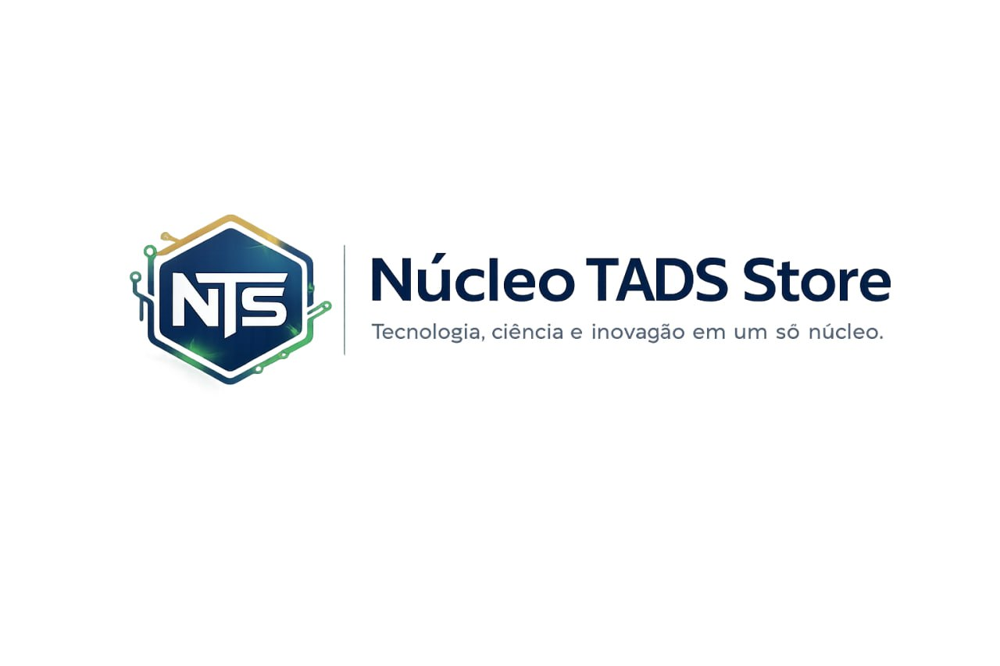

# Núcleo Storefront — Atividade Acadêmica IFES/TADS

<div align="center">
  
  <br />
  <br />

  [](https://react.dev)
  [](https://vitejs.dev)
  [](LICENSE)
  [](https://www.nucleotatico.com)
  <br />
  <strong>Atividade Acadêmica — IFES · Tecnologia em Análise e Desenvolvimento de Sistemas (TADS)</strong>
  <br />
  <em>Projeto integrador de componentização em React para disciplina de Desenvolvimento Web Front-end</em>
</div>

---

## 📋 Índice

- [Contexto Acadêmico](#-contexto-acadêmico)
- [Visão Geral](#-visão-geral)
- [Arquitetura](#-arquitetura)
- [Stack Tecnológico](#-stack-tecnológico)
- [Requisitos da Atividade](#-requisitos-da-atividade)
- [Demonstração](#-demonstração)
- [Instalação](#-instalação)
- [Estrutura de Componentes](#-estrtura-de-componentes)
- [API de Produtos](#-api-de-produtos)
- [Roadmap de Evolução](#-roadmap-de-evolução)
- [Licença](#-licença)
- [Autor](#-autor)

---

## 🎓 Contexto Acadêmico

| Campo | Informação |
|-------|------------|
| **Instituição** | Instituto Federal do Espírito Santo (IFES) |
| **Curso** | Tecnologia em Análise e Desenvolvimento de Sistemas (TADS) |
| **Disciplina** | Desenvolvimento Web Front-end |
| **Atividade** | Semana 12 / Etapa 1 — Projeto Integrador |
| **Tema** | Componentização em React |
| **Período** | 2024/2025 |

Esta atividade integra os conhecimentos de **componentização**, **composição**, **props**, **renderização condicional** e **listas em React**, aplicados na construção de uma interface de e-commerce acadêmica.

---

## 🎯 Visão Geral

O **Núcleo Storefront** é uma vitrine digital desenvolvida como projeto integrador da disciplina de Desenvolvimento Web Front-end do IFES/TADS. O projeto demonstra a aplicação prática de conceitos fundamentais de React:

- **Componentização** — divisão da UI em componentes reutilizáveis e independentes
- **Composição** — uso de `props.children` para layouts flexíveis
- **Props** — passagem de dados entre componentes pai e filho
- **Renderização de listas** — uso de `.map()` com `key` para performance
- **Renderização condicional** — exibição de elementos baseada em estado/props

Construído com React 18 e Vite, o projeto simula uma loja virtual de produtos de tecnologia para estudantes de TI, incorporando identidade visual institucional e boas práticas de desenvolvimento front-end.

---

## 🏗️ Arquitetura

```
nucleo-storefront/
├── src/
│   ├── components/          # Componentes reutilizáveis
│   │   ├── Cabecalho.jsx    # Header + Hero section + SVG logo
│   │   ├── Layout.jsx       # Wrapper composicional
│   │   ├── Vitrine.jsx      # Grid de produtos + dados
│   │   ├── ProdutoCard.jsx  # Card individual (imagem, selos, preço)
│   │   ├── Botao.jsx        # CTA primário
│   │   ├── Selo.jsx         # Badge/tag component
│   │   └── Rodape.jsx       # Footer
│   ├── App.jsx              # Root composition
│   ├── main.jsx             # Entry point (React 18 createRoot)
│   └── App.css              # Design system + layout grid
├── index.html
├── package.json
└── vite.config.js
```

### Diagrama de Composição

```
App
└── Layout (props.children)
    ├── Cabecalho
    │   └── LogoNTS (SVG inline + gradientes)
    ├── Vitrine
    │   └── ProdutoCard × N
    │       ├── Selo (destaque)
    │       ├── Selo (frete grátis — condicional)
    │       └── Botao (CTA)
    └── Rodape
```

---

## 🛠️ Stack Tecnológico

| Camada | Tecnologia | Versão | Propósito |
|--------|------------|--------|-----------|
| **Framework UI** | React | 18.3.1 | Biblioteca declarativa para interfaces |
| **Bundler** | Vite | 5.4.10 | Build ultra-rápido, HMR instantâneo |
| **Runtime** | Node.js | 18+ | Ambiente de execução |
| **Styling** | CSS3 puro | — | Design system customizado, sem dependências |
| **Ícones/Assets** | SVG inline | — | Logo vetorial, gradientes, circuitos decorativos |
| **Imagens** | Unsplash CDN | — | Assets de produto (placeholder) |

### Decisões arquiteturais

- **Sem CSS frameworks** → Controle total sobre identidade visual NTS
- **SVG inline** → Logo responsivo, animável, sem requests externos
- **Array fixo de produtos** → Simulação de backend para demonstração de `map()` e `key`
- **Props drilling** → Padrão didático; pronto para evolução para Context API ou Redux

---

## ✅ Requisitos da Atividade

### Checklist de entrega

- [x] **Projeto criado com React + Vite**
- [x] **Componentes reutilizáveis** — Cabecalho, Layout, Vitrine, ProdutoCard, Botao, Selo, Rodape
- [x] **Layout com `props.children`** — Layout composicional flexível
- [x] **Cabeçalho com identidade visual** — SVG logo, gradientes, tagline
- [x] **Vitrine de produtos** — Grid com 6 produtos curados
- [x] **Cards reutilizáveis** — ProdutoCard com props dinâmicas
- [x] **Props** — Passagem de dados entre componentes
- [x] **Composição** — Layout envolvendo children
- [x] **Array fixo de produtos** — Dados simulados para demonstração
- [x] **Renderização com `.map()`** — Lista dinâmica de produtos
- [x] **Uso de `key`** — Chave única para reconciliação eficiente
- [x] **Renderização condicional** — Selo de frete grátis exibido apenas quando `freteGratis === true`
- [x] **CSS próprio** — Identidade visual clara e consistente

### Conceitos demonstrados

| Conceito | Onde foi aplicado | Exemplo no código |
|----------|-------------------|-------------------|
| **Componentização** | Todos os `.jsx` | `Cabecalho`, `Vitrine`, `ProdutoCard` |
| **Props** | `Cabecalho`, `ProdutoCard`, `Botao`, `Selo` | `<Cabecalho titulo="Núcleo TADS Store" />` |
| **Children** | `Layout.jsx` | `<Layout>{children}</Layout>` |
| **Lista + key** | `Vitrine.jsx` | `produtos.map(p => <ProdutoCard key={p.id} ... />)` |
| **Condicional** | `ProdutoCard.jsx` | `{produto.freteGratis && <Selo ... />}` |
| **Formatação** | `ProdutoCard.jsx` | `preco.toLocaleString("pt-BR", {currency: "BRL"})` |

---

## 🖥️ Demonstração

```bash
# Clone o repositório
$ git clone https://github.com/matheusflorindo32/nucleo-storefront.git

# Instale as dependências
$ npm install

# Inicie o servidor de desenvolvimento
$ npm run dev

# Acesse http://localhost:5173
```

### Preview visual

> **Hero Section** — Branding NTS com proposta de valor e call-to-action  
> **Product Grid** — 6 cards responsivos com imagens, selos e preços  
> **Footer** — Identidade visual consistente

---

## 🚀 Instalação

### Pré-requisitos

- [Node.js](https://nodejs.org/) 18.x ou superior
- [npm](https://www.npmjs.com/) 9.x ou superior

### Passo a passo

```bash
# 1. Clone o repositório
$ git clone https://github.com/matheusflorindo32/nucleo-storefront.git
$ cd nucleo-storefront

# 2. Instale as dependências
$ npm install

# 3. Inicie o servidor de desenvolvimento
$ npm run dev

# 4. Abra no navegador
$ open http://localhost:5173
```

### Scripts disponíveis

| Script | Comando | Descrição |
|--------|---------|-----------|
| **Dev** | `npm run dev` | Servidor de desenvolvimento com HMR |
| **Build** | `npm run build` | Build otimizado para produção (`dist/`) |
| **Preview** | `npm run preview` | Preview da build de produção |

---

## 🧩 Estrutura de Componentes

### 1. `Cabecalho.jsx` — Header + Hero
- **LogoNTS** → SVG vetorial com gradientes lineares, hexágono e circuitos decorativos
- **Hero section** → Badge, headline com accent, subtítulo
- **Props:** `titulo` (string) — título customizável do header

### 2. `Layout.jsx` — Wrapper Composicional
- Recebe `children` via props
- Estrutura semântica: `<header>`, `<main>`, `<footer>`
- Permite troca de conteúdo sem alterar a estrutura

### 3. `Vitrine.jsx` — Grid de Produtos
- Array fixo `produtos` com 6 itens
- Cada produto: `id`, `nome`, `preco`, `categoria`, `descricao`, `freteGratis`, `destaque`, `imagem`
- Renderização com `.map()` e `key={produto.id}`
- CSS Grid responsivo

### 4. `ProdutoCard.jsx` — Card Individual
- **Props:** `produto` (object)
- **Renderização condicional:** `freteGratis && <Selo />`
- **Formatação:** `toLocaleString("pt-BR", { style: "currency", currency: "BRL" })`
- **Children:** `Selo`, `Botao`

### 5. `Selo.jsx` — Badge/Tag
- **Props:** `texto` (string), `cor` (string hex)
- Componente atômico, reutilizado em múltiplos contextos

### 6. `Botao.jsx` — Call-to-Action
- **Props:** `texto` (string)
- Estado visual: hover, focus, active
- Semântico: `<button>` com acessibilidade

### 7. `Rodape.jsx` — Footer
- Branding, links, copyright
- Identidade visual consistente

---

## 📦 API de Produtos

Atualmente o catálogo é um array fixo. Futuramente será substituído por uma API RESTful.

### Estrutura do produto

```typescript
interface Product {
  id: number;           // Identificador único (UUID futuramente)
  nome: string;         // Nome do produto
  preco: number;        // Preço em BRL (centavos futuramente)
  categoria: string;    // Categoria (Computadores, Periféricos, etc.)
  descricao: string;    // Descrição curta
  freteGratis: boolean; // Flag de frete grátis
  destaque: string;     // Badge de destaque
  imagem: string;       // URL da imagem (Unsplash CDN)
}
```

### Produtos do catálogo

| ID | Produto | Categoria | Preço | Frete Grátis | Destaque |
|----|---------|-----------|-------|--------------|----------|
| 1 | Notebook Núcleo Pro | Computadores | R$ 4.599,90 | ✅ | Mais vendido |
| 2 | Mouse Apex Precision | Periféricos | R$ 189,90 | ✅ | Alta precisão |
| 3 | Teclado TADS Mechanical | Periféricos | R$ 349,90 | ❌ | Dev choice |
| 4 | Monitor Científico View 24 | Monitores | R$ 899,90 | ✅ | Full HD |
| 5 | Headset Tropa Comms | Áudio | R$ 279,90 | ❌ | Áudio limpo |
| 6 | Webcam Aula Pro HD | Imagem | R$ 219,90 | ✅ | Home office |

---

## 🗺️ Roadmap de Evolução

### Fase 1 — Fundação (✅ Concluída)
- [x] Setup React + Vite
- [x] Componentização básica
- [x] Layout com composição
- [x] Renderização de lista com `.map()` e `key`
- [x] Renderização condicional (selo frete grátis)
- [x] CSS próprio com identidade visual

### Fase 2 — Interatividade (📋 Planejada)
- [ ] Estado global (Context API ou Zustand)
- [ ] Carrinho de compras
- [ ] Contador de itens no header
- [ ] Filtros de categoria
- [ ] Busca em tempo real

### Fase 3 — Escalabilidade (📋 Planejada)
- [ ] React Router (SPA navigation)
- [ ] Página de detalhe do produto
- [ ] Backend API (Node.js + Express)
- [ ] Banco de dados (MongoDB/PostgreSQL)
- [ ] Autenticação (JWT)
- [ ] Painel administrativo

### Fase 4 — Produção (📋 Planejada)
- [ ] Testes unitários (Vitest + React Testing Library)
- [ ] Testes E2E (Playwright)
- [ ] CI/CD (GitHub Actions)
- [ ] Deploy (Vercel/Netlify)
- [ ] Analytics (Plausible/Google Analytics)
- [ ] SEO otimizado (SSR ou SSG)

---

## 📝 Documentação e Revisão

Este README foi revisado e aprimorado com assistência de IA (Kimi Claw) para garantir clareza técnica, padronização acadêmica e apresentação profissional. O conteúdo original, arquitetura e código do projeto foram desenvolvidos pelo autor.

---

## 📄 Licença

Este projeto está licenciado sob a **MIT License** — veja o arquivo [LICENSE](LICENSE) para detalhes.

```
MIT License

Copyright (c) 2024-2025 Matheus Florindo de Deus

Permission is hereby granted, free of charge, to any person obtaining a copy
of this software and associated documentation files (the "Software"), to deal
in the Software without restriction, including without limitation the rights
to use, copy, modify, merge, publish, distribute, sublicense, and/or sell
copies of the Software, and to permit persons to whom the Software is
furnished to do so, subject to the following conditions:

The above copyright notice and this permission notice shall be included in all
copies or substantial portions of the Software.
```

---

## 👤 Autor

**Matheus Florindo de Deus**

- **Curso:** TADS — IFES
- **Website:** [www.nucleotatico.com](https://www.nucleotatico.com)
- **GitHub:** [@matheusflorindo32](https://github.com/matheusflorindo32)
- **Email:** [matheusdideusf@gmail.com](mailto:matheusdideusf@gmail.com)
- **LinkedIn:** [Matheus Florindo](https://linkedin.com/in/matheusflorindo)

<div align="center">
  <sub>🎖️ <strong>NTS</strong> — Núcleo TADS Store · Atividade Acadêmica IFES/TADS · React 18 + Vite</sub>
</div>
